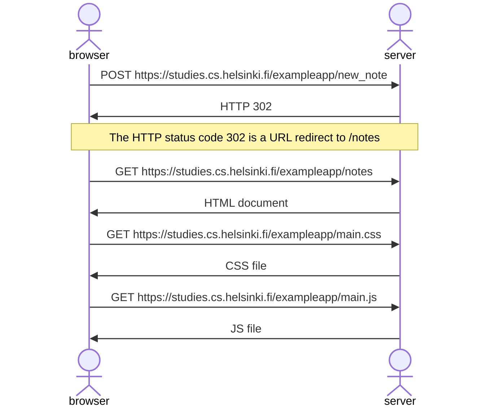

```mermaid
    sequenceDiagram
        actor browser
        actor server
        browser->>server: POST https://studies.cs.helsinki.fi/exampleapp/new_note
        server->>browser: HTTP 302
        Note over browser, server: The HTTP status code 302 is a URL redirect to /notes
        browser->>server: GET https://studies.cs.helsinki.fi/exampleapp/notes
        server->>browser: HTML document
        browser->>server: GET https://studies.cs.helsinki.fi/exampleapp/main.css
        server->>browser: CSS file
        browser->>server: GET https://studies.cs.helsinki.fi/exampleapp/main.js
        server->>browser: JS file
```