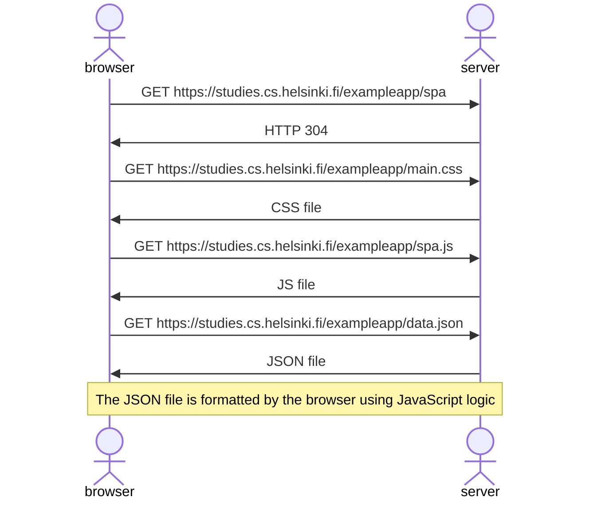

```mermaid
    sequenceDiagram
        actor browser
        actor server
        browser->>server: GET https://studies.cs.helsinki.fi/exampleapp/spa
        server->>browser: HTTP 304 
        browser->>server: GET https://studies.cs.helsinki.fi/exampleapp/main.css
        server->>browser: CSS file
        browser->>server: GET https://studies.cs.helsinki.fi/exampleapp/spa.js
        server->>browser: JS file
        browser->>server: GET https://studies.cs.helsinki.fi/exampleapp/data.json
        server->>browser: JSON file
        Note over browser, server: The JSON file is formatted by the browser using JavaScript logic
```